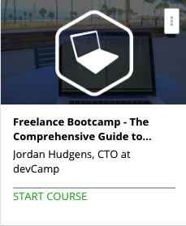

```
Roberto Nogueira  
BSd EE, MSd CE
Solution Integrator Experienced - Certified by Ericsson
```
# Project Freelance Bootcamp



**About**

Learn everything you need to about the subject of this `Freelance Bootcamp` project.

[Homepage](https://www.udemy.com/freelance-bootcamp-comprehensive-guide-to-freelancing/learn/v4/content)

## Topics
```
Section: 1
0 / 3
Is Freelancing Right for You?
[ ] 1. Benefits to Freelancing 5:48
[ ] 2. Challenges to Freelancing 3:22
[ ] 3. Freelancer Manifesto Book Download 0:00

Section: 2
0 / 9
Preparing for Launch
[ ] 4. Section introduction 0:49
[ ] 5. Scheduling Your Freelance Business Launch 3:30
[ ] 6. Creating a Freelance Portfolio 6:17
[ ] 7. Building a List of Freelance Services 2:44
[ ] 8. Creating a Website for a Freelance Business 7:09
[ ] 9. Creating Freelance Marketing Websites for Specific Client Categories 6:10
[ ] 10. Creating a Targeted Set of Sales Proposals 12:49
[ ] 11. Freelance Proposal Templates 16:26
[ ] 12. Setup Bookkeeping Services 9:54

Section: 3
0 / 5
How to Get Freelance Clients
[ ] 13. Section Introduction 0:52
[ ] 14. An Overview of Where to Get Freelance Clients 3:17
[ ] 15. The Secret to Getting Clients on Outsourcing Services 7:00
[ ] 16. Soft Skills for Becoming More Appealing to Freelancers 12:45
[ ] 17. How to Organically Grow a Freelance Business 19:57

Section: 4
0 / 14
Project Management for Freelancers
[ ] 18. Section Introduction 2:56
[ ] 19. How to Create an Accurate Project Bid as a Freelancer 8:32
[ ] 20. Feature Requirement Elicitation Process 9:35
[ ] 21. Project Management Application Tools for Freelancers 15:25
[ ] 22. Introduction to Using Git to Manage Freelance Projects 7:10
[ ] 23. How to Use GitHub Part 1 of 2 12:22
[ ] 24. How to Use GitHub Part 2 of 2 12:25
[ ] 25. Automating Daily Updates to Clients 6:03
[ ] 26. How to Remotely Demo Work for Freelance Clients 10:50
[ ] 27. Freelance Guide to Managing Advanced Features 10:33
[ ] 28. Defining Project Success as a Freelance Developer 12:28
[ ] 29. Managing Outsourced Developers 10:13
[ ] 30. Dodging Silver Bullets as a Freelancer 7:15
[ ] 31. Freelancer Prototyping Tools 13:38

Section: 5
0 / 3
Testing Freelance Projects
[ ] 32. Section Introduction 1:26
[ ] 33. Using TDD (Test Driven Development) on Freelance Projects 11:42
[ ] 34. Generating a Code Quality Report for Freelance Projects 9:58
 
Section: 6
0 / 4
Working with Legacy Applications
[ ] 35. Section Introduction 1:25
[ ] 36. How to Take Over a Legacy Application as a Freelancer 12:17
[ ] 37. Freelancer Interview: Practical Tips for Taking Over Legacy Applications 0:00
[ ] 38. Starting Over vs Refactoring on Legacy Applications 14:52

Section: 7
0 / 5
Managing Client Relationships
[ ] 39. Section Introduction 0:50
[ ] 40. How to Managing Client Communication as a Freelancer 8:25
[ ] 41. Managing Conflicts with Clients as a Freelancer 7:22
[ ] 42. Knowing When to Fire a Client as a Freelancer 12:06
[ ] 43. Top Books for Freelance Developers 0:00
```
